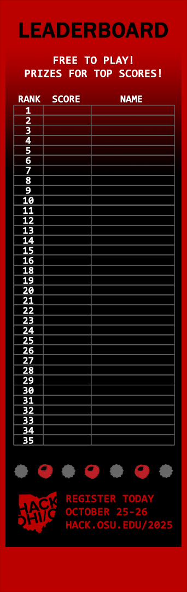

# BlockOHI/O :video_game:
Tetrominoes @ The Ohio State University

| Dependency | Version |
| ---------- | ------- |
| [Python](https://www.python.org/)               | v3.7+   |
| [Arcade](https://api.arcade.academy/en/2.6.15/) | v2.6.15 |
| [AntiMicro](https://github.com/AntiMicro/antimicro/releases) | v2.23 |
| OpenGL     | v3.3+   |

Complete [requirements.txt](./requirements.txt) included.

## Game Window Design

|Screen           | Pixels (px)|
|-----------------|------------|
|Tower            |342 x 1080  |  
|Game Area        |342 x 1008  |
|Program Display  |1920 x 1080 |

72 px buffer on the bottom of the Tower screen  

## Structure Theory  
This section details information on how the game was designed and is intended to operate.

#### Game Views
A view represents a page in which the user sees on-screen. This game has four primary views as detailed below.

| 4 Main views    | Key to Switch View |  
|-----------------|--------------------|
|`MenuView`       |`F1`|
|`LeaderBoardView`|`F2`|
|`NewPlayer`      |`F3`|
|`GameView`       | *Progression from* `NewPlayer`|

#### Backgrounds

| Menu | Leaderboard | New Player | Game |
| -- | -- | -- | -- |
|  |  |  |  |

#### Leaderboard/Score Saving Design    
1. Game should pull from external txt/dat file for current leaderboard.  
2. Game should save to external txt/dat file for leaderboard progression.  
3. Leaderboard file updated after completion of each game  
4. File must be saved in `src` file and named: `tetris_scores.csv`

#### Screen & Game Logic Progression
The location of falling blocks (individual sprite tiles) is updated with every logic loop and redrawn on every screen (FPS) update.

Game Logic Updates & Window Redraw Updates are separately called and monitored. The diagnostics panel reports the game logic rate as UPS and the redraw rate as FPS. Arcade will attempt to update the game logic at 60 UPS. 

> Game level determines scoring and game speed.

Game levels are updated based on time elapsed in game play. The number of levels is correlated to the total number of time levels defined.

> Game speed is the number of frames between stone drops.

Game speed denotes the frequency in which blocks are dropped (incremented down) and is directly related to the number of frames elapsed. Must be an integer.
`Speed = (# of Levels) - Current Level + GAME_SPEED_FLOOR`
